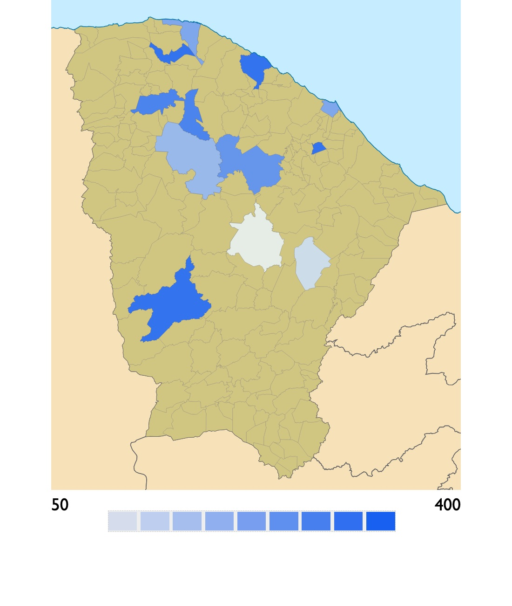

# Ceará choropleth in plain SVG

Live: https://brunoskyy.github.io/svg-ceara_scale/

An SVG map of the state of Ceará, in Brazil, with one `<path>` per
municipality (190 of them), plus a small script that colors each one from a
value in a JSON object and draws the legend to match. I made it in November
2019 for infographics: election results, population density, anything with a
number per city.

No build, no framework. Open `index.html` and it works.



## Feeding it data

The data lives at the top of `assets/js/main.js` as a plain object:

```js
var json = {
  "categoria": "Densidade Demográfica",
  "cidades": [
    { "id": "fortaleza", "value": 240, "nome": "Fortaleza" },
    { "id": "sobral",    "value": 325, "nome": "Sobral" }
  ]
}
```

- `id` is the id of the municipality's `<path>` in `index.html`: the name in
  lowercase, without accents, with dashes for spaces (`santa-quiteria`).
- `value` is the number to plot.
- `nome` is what the popover shows.
- `categoria` is the label shown next to the value.

Municipalities left out of the list keep the default fill.

`assets/data/cidades.json` has the same shape; it is there for the day this
loads data with a fetch instead of a variable.

## How the scale works

The script takes the smallest and largest values, splits the range into nine
even intervals, and maps each interval to one opacity step of the same blue.
The legend under the map is built from the same intervals, and hovering a
municipality outlines the legend cell it falls into.

## What's missing

- The scale is linear, so one outlier (Fortaleza on a population map) pushes
  everything else into the lightest two steps. Quantiles would serve most
  datasets better.
- The popover position is a rough calculation from the mouse event; it drifts
  on narrow screens.
- Bootstrap and jQuery come from a CDN for the popover styling only; they
  could go.

There is a variant of this map for election results, with candidate names
instead of values, in
[svg-ceara_eleicoes](https://github.com/Brunoskyy/svg-ceara_eleicoes).
